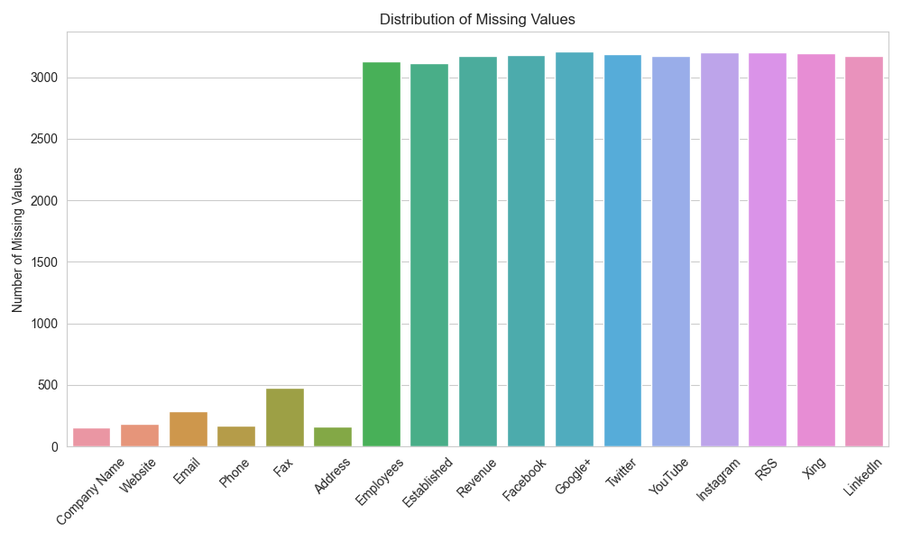
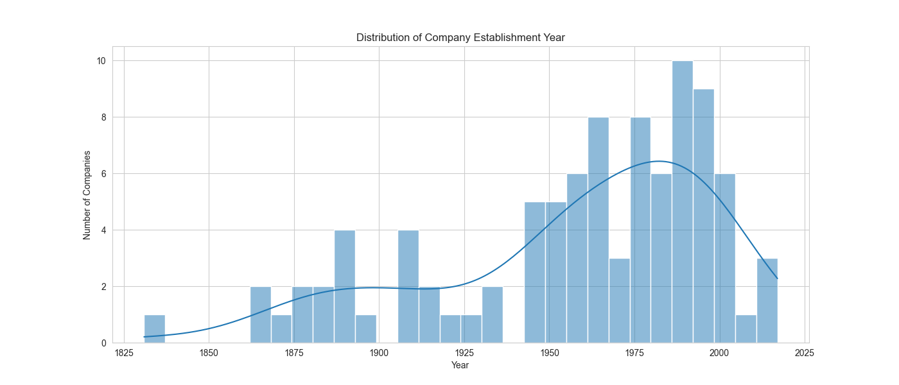

# Scrapy Project: Industrie.de

This Scrapy project is designed to scrape company details from [industrie.de/firmenverzeichnis/](https://industrie.de/firmenverzeichnis/). The spider extracts each company's information from the section "Daten und Kontakte" on its website.

### 1. Use a web scraping library (e.g., Beautiful Soup, Scrapy) to extract data from the website.

First I explored the structure of the web-site in shell, not to overload the website.
Starting by inspecting of HTML code of the web-side to acquire the selectors and trying out to get pieces of information.
For example:
`r = scrapy.Request(url='https://industrie.de/firmenverzeichnis/')`
`fetch(r)`  
`response.css('div.infoservice-result-row')`  
`response.css('div a::attr(href)').get()`  
`response.css('#post-2020 a')`  
`response.css('#post-2020 a::attr(href)').getall()`  
`response.css('div.h2 ::text').getall()`  
`response.xpath('//dd').getall()`  
`response.xpath('//div[@class="textwidget"]/dl/dd').getall()`  
`response.xpath('//div[@class="textwidget"]/dl/dd/text()').getall()`  
`etc.`

After working with shell, the following flaws/challenges were discovered:
* Some of the company links do not exist anymore.
* Some entries in "Daten und Kontakte" are missing, so we have to format check each entry not to mess the dataset we are creating.
For this I used an icon class for each entry type.
* After building up the first version of a spider and looking at the data, I noticed that very few companies have more icon classes such as revenue etc.
So I looked for all possible icon classes in shell:
  * fa fa-globe
  * fa fa-envelope
  * fa fa-phone
  * fa fa-fax
  * fa fa-group
  * fa fa-flag
  * fa fa-money
  * fa fa-map-pin
* Since address info consists of several lines, they were joined together and separated with a comma.

* Block with social media information was only visible in full screen mode on laptop, which was slightly misleading.
So I implemented another dictionary for those classes and scraped them separately since they were stored in different HTML
element than the classes before.
  * fa-facebook-square
  * fa-google-plus-square
  * fa-twitter-square
  * fa-youtube-square
  * fa-instagram
  * fa-rss-square
  * fa-xing-square
  * fa-linkedin-square

### 2. Clean and preprocess the scraped data, handling any missing values or inconsistencies.
After scraping the web-site I cleaned the data with pandas script data_cleaner.py.
* Missing values: I replaced possible missing values (NaN) with the string "N/A" so that they are consistent with the rest of the data.
* Redundant info in address entry: got rid of `</dd>`.
* Some of the web-site entries had format like e.g. `<a href="http://www.xsuite.com" target="_blank">www.xsuite.com</a>`.
So I extracted pure url from it.
* Similar with some of the e-mail entries that had format like `<a href="mailto:info@xsuite.com">info@xsuite.com</a>`.
* Extracted numbers only from 'Employees' and 'Established' columns for better future analysis.

### 3.Perform basic exploratory data analysis (EDA) on the extracted dataset. This could involve generating summary statistics, visualizing trends, or identifying patterns.
* Summary statistics gives us following insights on data:
  * Company Name: among 3,053 company entries 3,041 are unique ones, which makes duplicates or very similarly named companies possible.
  * Website and Email: vast majority of companies have given their website and email details. Very few - missing.
  * Phone and Fax: most companies have given their phone numbers, while fewer gave - fax.
  * Address: almost all companies have given an address.
  * Employees: 82 companies shared their number employees.
  * Established: 93 companies shared their year of establishment.
  * Revenue: revenue details are available for only 35 companies.
  * Social Media: few companies have provided links to their social media profiles. For instance, only 38 companies have shared their LinkedIn profiles.

* After I got all contact information cleaned and sorted properly, I decided to find out which data entry was missing the most.
So I did a bar chart to visualize it.

* The histogram on distribution of the years when companies were established.
This figure shows us that a significant number of companies in the dataset were established between the years 1980 and 2020.
And there was a noticeable uptick in the number of companies established from the 1990s onwards.
The highest frequency occurs for companies established around the early 2000s.
As a matter of fact, very little data was presented in 'Employees', 'Established', 'Revenue' and all social media entries.
That is why the value of any data analysis with these data points are questionable in its significancy.

